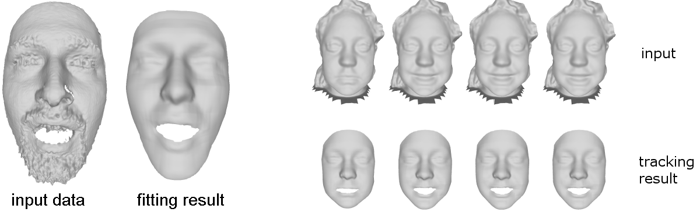
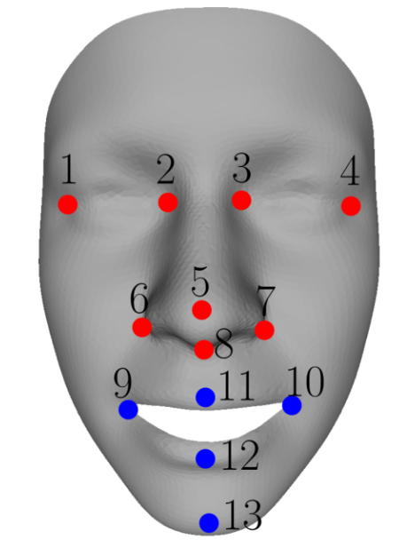

## Multilinear Wavelets: A Statistical Shape Space for Human Faces


The provided program loads a multilinear model described in the [scientific publication](https://arxiv.org/pdf/1401.2818.pdf) and fits this model to a point cloud or a triangle mesh.

<p align="center"> 

</p>

### Setup

The provided code has dependencies on the following libraries:
* Glut (http://user.xmission.com/ nate/glut.html). We recommend using Glut 3.7.6.
* Glew (http://glew.sourceforge.net/). We recommend using Glew 1.10.0.
* OpenCV (http://opencv.org/). We recommend using OpenCV 2.4.8.
* Insight Segmentation and Registration Toolkit ITK (http://www.itk.org/). We recommend using ITK 4.50.
* Clapack (http://www.netlib.org/clapack/). Clapack must be compiled using Blas (USE BLAS WRAP must be enabled when using CMake). We recommend using Clapac 3.2.1.
* Approximate Nearest Neighbor Library ANN (http://www.cs.umd.edu/ mount/ANN/). We recommend using ANN 1.1.2.

To setup the provided code, use CMake and specify the required Glut, Glew, OpenCV, ITK, Clapack and ANN paths. The project needs to be compiled as 64bit project. Successfully compiling the project outputs a LocalMultilinearWavelet.exe. The compiled libraries glut32.dll, glew32.dll, opencv core and ANN.dll, and the shader objects diffuse.fs, diffuse.vs, DisplayDispMap.fs, DisplayImage.fs, TemplateDisparityMap.fs, TemplateDisparityProject.vs, TemplateGeometryMap.fs and TemplateGeometryProject.vs must be copied into the generated project folder.

### Basic usage

To run the program, the MM Restricted.exe must be called with following 6 parameters, separated by a blank.
* model.lmm - full path of the used multilinear model. This parameter should point to the bu3dfe all scaled.lmm.
* templateMesh.off - full path of the training data template mesh, needed for the mesh structure of the result. This parameter should point to the MeanFace All Scaled.off.
* templateLmks.txt - full path of a text file including the landmark (x y z)-coordinates of the template mesh, the first 8 landmarks are used to compute a rigid alignment. This parameter should point to the All Lmks.txt.
* targetData.off - full path of the fitting target point cloud or triangle mesh.
* targetLmks.txt - full path of a text file including the landmark (x y z)-coordinates of the target face mesh, the first 8 landmarks are used to compute the rigid alignment.
* outFitting.off - full path of the fitting result file.
* maxPointDist - threshold for the maximum point distance used while fitting.
* priorBoxSize - size of the prior box.
* smootingInitWeight - weighting of the bi-Laplace smoothing while initialization.
* smootingFittingWeight - weighting of the Bi-Laplace smoothing while surface fitting.

##### Landmarks

<p align="center"> 

</p>
Figure: Suggested landmarks. Red: Landmarks used for rigid alignment computation and fitting. Blue: Landmarks used just for fitting.

The landmark files contain the concatenated (x y z)-coordinates of 13 specified landmarks, all coordinates separated by a line break. The first 8 landmarks are used to compute a rigid alignment between the target data and the local coordinate system of the model. The red landmarks of Figure 1 are recommended, since
they are relatively invariant to expression changes. Furthermore, all specified landmarks are used while
model fitting.

##### Target data

The target data need to be provided in an OFF-file format. Point clouds and triangle meshes are supported.

### Example

The provided example RegisterTestLocalMultilinearWavelet.cmd fits the local multilinear wavelet model to a point cloud named stereo pointcloud.off with specified landmarks stereo pointcloud landmarks.txt and outputs the fitted mesh as OFF-file named stereo pointcloud fitting.off. To run the example, all paths within
the RegisterTestLocalMultilinearWavelet.cmd must be adjusted to point to the specified files. By exchanging the parameters of the target data, target landmarks and output fitting file name, this can be used to fit any other target OFF-file.

### License
The source is provided for NON-COMMERCIAL RESEARCH PURPOSES only, and is provided as is WITHOUT ANY WARRANTY; without even the implied warranty of fitness for a particular purpose. The redistribution of the code is not permitted.

### Citing

When using this code in a scientific publication, please cite 
```
@inproceedings{BolkartWuhrer2016_rmm,
  title = {Multilinear wavelets: A statistical shape space for human faces},
  author = {Brunton, Alan and Bolkart, Timo and Wuhrer, Stefanie},
  booktitle = {European Conference on Computer Vision (ECCV)},
  pages={297--312},
  year={2014}
}
```
